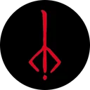
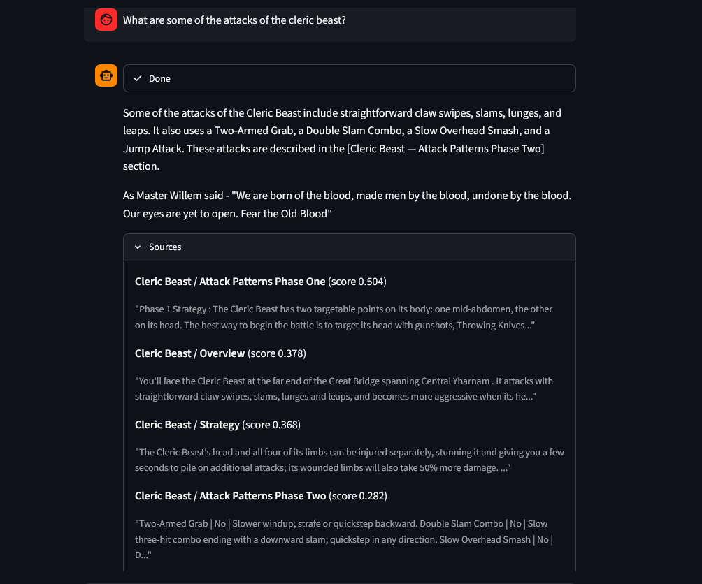

<div align="center">



# Bloodborne RAG

**A retrieval-augmented Question answering assistant for Bloodborne boss strategy, built on locally-hosted Qwen3 models.**

[]()
[]()
[]()
[]()

</div>

---

Ask questions about Bloodborne bosses and get answers grounded **only** in
content scraped from [bloodborne-wiki.com](https://www.bloodborne-wiki.com/).
The model is told not to use any outside knowledge. Every answer cites the
boss page and section it came from and ends with a quote from Master Willem.
The Hunter's Mark icon above is taken from the [r/bloodborne](https://www.reddit.com/r/bloodborne/) subreddit, I do not claim it to be mine.
<div align="center">
  
  <br />
  <sub>Asking the assistant about Cleric Beast attack patterns, with sources and confidence scores shown below the answer.</sub>
</div>


## How it works

1. **Scrape & parse** — boss pages are fetched and their HTML sections (description, strategy, attack patterns, etc.) are extracted.
2. **Chunk & dedupe** — sections are chunked, and cross-page boilerplate is stripped out.
3. **Embed** — chunks are embedded and stored in a local vector index.
4. **Retrieve → rerank → generate** — on each question, the top candidates are pulled by embedding similarity, reranked with a cross-encoder, then passed to the generation model, which is instructed to answer only from that context.

The project is meant to be run locally on Intel Arc hardware and uses the [OpenARC](https://github.com/SearchSavior/OpenArc) framework, since Intel pulled support from its [IPEX-LLM library](https://github.com/intel/ipex-llm).

## Models

Qwen3 models in the OpenVINO format are used for embedding, generation and reranking:

| Stage | Model |
|---|---|
| Generation | [Qwen3-14B-int4-ov](https://huggingface.co/OpenVINO/Qwen3-14B-int4-ov) |
| Embedding | [Qwen3-Embedding-0.6B-int4-cw-ov](https://huggingface.co/OpenVINO/Qwen3-Embedding-0.6B-int4-cw-ov) |
| Reranking | [Qwen3-Reranker-0.6B-int8-ov](https://huggingface.co/OpenVINO/Qwen3-Reranker-0.6B-int8-ov) |

Example of downloading a model:

```bash
hf download OpenVINO/Qwen3-Embedding-0.6B-int4-cw-ov --local-dir LOCATION_TO_STORE_MODEL
```

## Getting started

### 1. Start the OpenARC server (host option is for running on Windows)

```bash
cd path/to/openarc
uv sync
.\.venv\Scripts\activate
openarc serve start --host 127.0.0.1
```

### 2. Load the three models (from another terminal)

```bash
cd path/to/openarc
.\.venv\Scripts\activate

openarc add --model-name qwen3-14b --model-path PATH_TO_LLM --engine ovgenai --model-type llm --device GPU
openarc add --model-name qwen3-embed --model-path PATH_TO_EMBEDDING_MODEL --engine optimum --model-type emb --device GPU
openarc add --model-name qwen3-rerank --model-path PATH_TO_RERANKER --engine optimum --model-type rerank --device GPU

openarc load qwen3-14b
openarc load qwen3-embed
openarc load qwen3-rerank
```

### 3. Build the index and run the app

```bash
# install this project's dependencies
uv sync

# scrape the wiki and build chunks
python parsing/main.py

# embed the chunks into a vector store
python generation/embed_store.py

# run the CLI...
python generation/cli.py

# ...or the Streamlit UI
streamlit run frontend/streamlit_app.py
```

## Project layout

```
parsing/     scraping, parsing and chunking the wiki into wiki_chunks.jsonl
generation/  embedding, retrieval, reranking and answer generation (rag_config.py holds all settings)
frontend/    Streamlit chat UI
```

